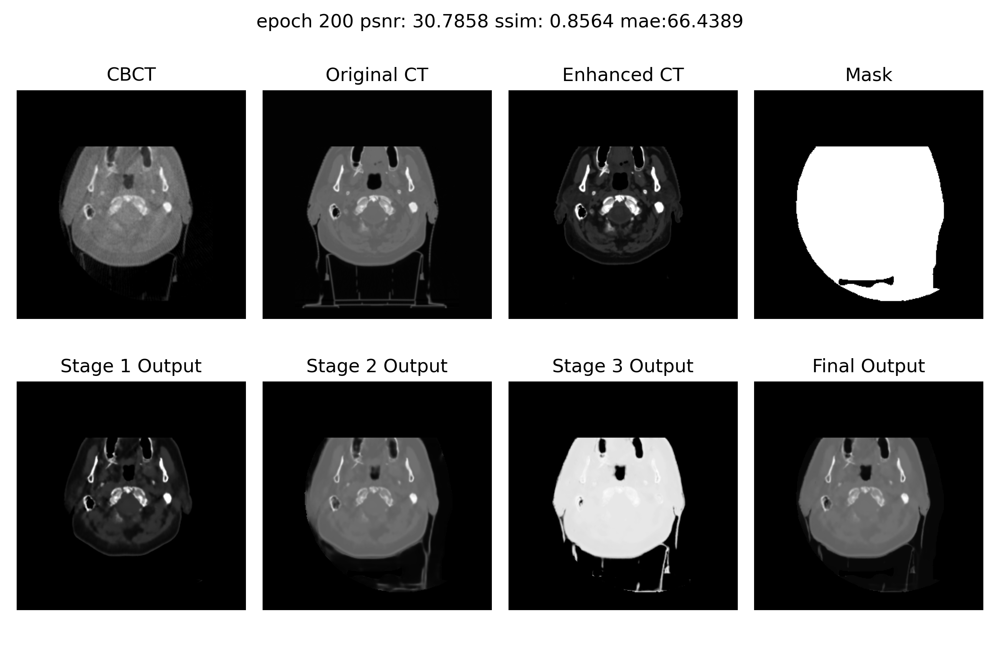

# [CBCT-to-CT](https://github.com/YMZ1998/CBCT-to-CT)

CBCT (Cone Beam Computed Tomography) generates pseudo CT images, which are essential for applications where traditional
CT scans are unavailable or difficult to acquire.

## Dataset

[Synthrad2023](https://synthrad2023.grand-challenge.org/)

[SynthRAD2023 Grand Challenge](https://github.com/SynthRAD2023)

Data structure

```
Brain_Pelvis
-train
|-brain
  |-1BA001
    |-ct.nii.gz
    |-mr.nii.gz
    |-mask.nii.gz
  |- ...
  |-1BA005
    |-ct.nii.gz
    |-mr.nii.gz
    |-mask.nii.gz
|-pelvis
  |-1PA001
    |-ct.nii.gz
    |-mr.nii.gz
    |-mask.nii.gz
  |- ...
  |-1PA004
    |-ct.nii.gz
    |-mr.nii.gz
    |-mask.nii.gz

-test
|-brain
  |- ...
|-pelvis
  |- ...
```

## Result



## Environment

```bash
conda env create -f env.yml
```

```bash
conda activate lj_py
```

```bash
conda env export --no-builds > env.yml
```

## PyInstaller Installation Guide:

### 1. Create and Activate Conda Environment

```bash
conda create --name cbct2ct python=3.9
```

```bash
conda activate cbct2ct
```

### 2. Install Required Python Packages

```bash
pip install -i https://pypi.tuna.tsinghua.edu.cn/simple pyinstaller
pip install -i https://pypi.tuna.tsinghua.edu.cn/simple SimpleITK
pip install -i https://pypi.tuna.tsinghua.edu.cn/simple onnxruntime
pip install -i https://pypi.tuna.tsinghua.edu.cn/simple tqdm
```

### 3. Deactivate and Remove Conda Environment

```bash
conda deactivate
conda remove --name cbct2ct --all
```

### 4. Use PyInstaller to Package Python Script

```bash
pyinstaller --name CBCT2CT --onefile CBCT2CT.py
```

### 5. Clean the Build Cache and Temporary Files

```bash
pyinstaller --clean CBCT2CT.spec
```

### 6. Run the Executable

Once the build is complete, you can run the generated `CBCT2CT.exe` with the required parameters:

```bash
CBCT2CT.exe --cbct_path ./test_data/cbct.nii.gz --mask_path ./test_data/mask.nii.gz --result_path ./result --onnx_path ./checkpoint/cbct2ct.onnx
```

- `--cbct_path ./test_data/cbct.nii.gz`: Path to the input CBCT image file.
- `--mask_path ./test_data/mask.nii.gz`: Path to the input mask file.
- `--result_path ./result`: Path where the results will be saved.
- `--onnx_path ./checkpoint/cbct2ct.onnx`: Path to the ONNX model.

## Reference

[A Simple Two-stage Residual Network for MR-CT Translation](https://github.com/ZhangZhiHao233/MR-to-CT)
